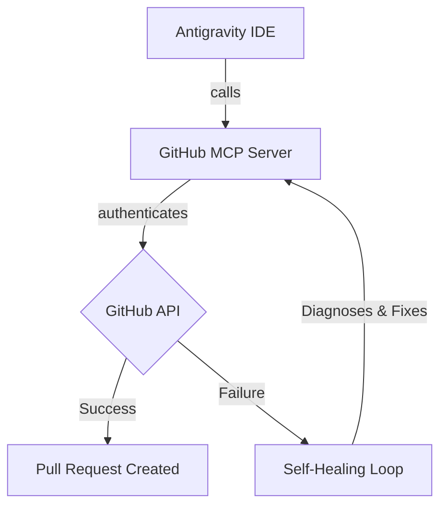

# Antigravity Smart MCP Architecture Test

This document outlines the architecture for the Antigravity MCP integration test, created "smartly" with proper markdown elements.

## Flow Diagram

## Features Demonstrated
1. **Dynamic Authentication**: Verifying that the IDE correctly provisions the token.
2. **Branch Management**: Switching contexts and creating structured features.
3. **Pull Request Automation**: Programmatically interacting with GitHub's Pull Request system.

> [!TIP]
> This proves that the GitHub MCP integration is working flawlessly for advanced Git-ops workflows!
